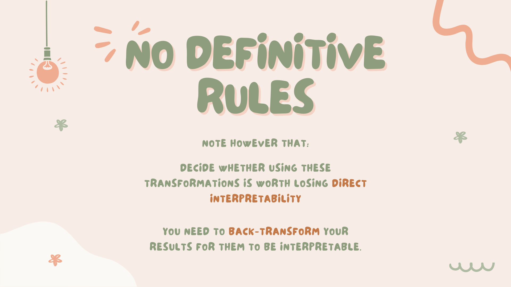

<h1 style="color:#5A59A8">Executive Summary</h1>

Getting accurate results is the goal of every machine learning project. But feeding data as it is to a model does not always give the desired outcome. And doing so will introduce certain biases to your machine learning model as it learns. One way to mitigate this problem is by feature transformation or feature scaling. But how would you exactly know what feature transformation technique to use in certain situations?

&nbsp

Data is transformed to make it better-organized. Transformed data may be easier for both humans and computers to use. [11] Feature transformation is an essential data preprocessing technique that ensures all of our metrics are uniform which allows for better model performance. This also ensures that algorithms moves smoothly and is applied and updated at the same rate for all features.

&nbsp

For this notebook, we will explore nine (9) data transformation techniques and how these techniques boosts model performance. These techniques will be divided into three main categories namely: Function Transformation, Power Transformation, and Other Transformation. 

&nbsp

<h1 style="color:#5A59A8">Introduction</h1>

<h2 style="color:#E14C92">Transformation of Features</h2>

<h3 style="color:#0094AD">What is Feature Transformation?</h3>

1. 
It is a technique by which we can boost our model performance. Feature transformation is a mathematical transformation in which we apply a mathematical formula to a particular column(feature) and transform the values which are useful for our further analysis. [1]

2. 
It is also known as Feature Engineering, which is creating new features from existing features that may help in improving the model performance. [1]

3. 
It refers to the family of algorithms that create new features using the existing features. These new features may not have the same interpretation as the original features, but they may have more explanatory power in a different space rather than in the original space. [1]

4. 
This can also be used for Feature Reduction. It can be done in many ways, by linear combinations of original features or by using non-linear functions. [1]

5. 
It helps machine learning algorithms to converge faster. [1]

<h3 style="color:#0094AD">What are the Different Types Transformation?</h3>

1. 
 Function Transformation 

2. 
 Power Transformation 

3. 
 Other Transformation 

<h2 style="color:#E14C92">Function Transformation</h2>

**Log Transformation**

The log transformation is, arguably, the most popular among the different types of transformations used to transform skewed data to approximately conform to normality. [2]

**Reciprocal Transformation**

The reciprocal transformation is defined as the transformation of x to 1/x. The transformation has a dramatic effect on the shape of the distribution, reversing the order of values with the same sign. The transformation can only be used for non-zero values. [3]

**Square Transformation**

The square root, x to x^(1/2) = sqrt(x), is a transformation with a moderate effect on distribution shape: it is weaker than the logarithm and the cube root. It is also used for reducing right skewness, and also has the advantage that it can be applied to zero values. Note that the square root of an area has the units of a length. It is commonly applied to counted data, especially if the values are mostly rather small. [4]

**Square Root Transformation**

The square, x to x^2, has a moderate effect on distribution shape and it could be used to reduce left skewness. In practice, the main reason for using it is to fit a response by a quadratic function y = a + b x + c x^2. [4]

<h2 style="color:#E14C92">Power Transformation</h2>

**Box-Cox Transformation**

A Box Cox transformation is a transformation of non-normal dependent variables into a normal shape. Normality is an important assumption for many statistical techniques; if your data isn’t normal, applying a Box-Cox means that you are able to run a broader number of tests. [6]

**Yeo-Johnson Transformation**

The Yeo-Johnson family of transformations modifies and generalizes the Box-Cox family to handle data where the smallest value of y may be zero or negative. For non-negative values of y, it finds the Box-Cox transformation of y+1. [7]

<h2 style="color:#E14C92">Other Transformation</h2>

**Normalization and Standardization**
1. 
Normalization is used when the data doesn't have Gaussian distribution whereas Standardization is used on data having Gaussian distribution. [8]

2. 
Normalization scales in a range of [0,1] or [-1,1]. Standardization is not bounded by range. [8]

3. 
Normalization is highly affected by outliers. Standardization is slightly affected by outliers. [8]

4. 
Normalization is considered when the algorithms do not make assumptions about the data distribution. Standardization is used when algorithms make assumptions about the data distribution. [8]

**Min-Max Scaling**
1. 
MinMax Scaler is one of the most popular scaling algorithms. It transforms features by scaling each feature to a given range, which is generally [0,1], or [-1,-1] in case of negative values. [9]

2. 
It subtracts the mean of the column from each value and then divides by the range, i.e, max(x)-min(x). [9]

3. 
This scaling algorithm works very well in cases where the standard deviation is very small, or in cases which don’t have Gaussian distribution. [9]

**Quantile and Median Scaling**
1. 
When scaling variables to the median and quantiles, the median value is removed from the observations and the result is divided by the inter-quartile range (IQR). The IQR is the range between the 1st quartile and the 3rd quartile, or, in other words, the range between the 25th quantile and the 75th quantile. [10]

2. 
This method is known as robust scaling because it produces more robust estimates for the center and value range of the variable, and is recommended if the data contains outliers. [10]

<h2 style="color:#E14C92">Summary of Transformations</h2>

1. Normalization and Standardization
2. Min-Max Scaling
3. Robust Scaling
4. Log Transformation
5. Reciprocal Transformation
6. Square Transformation
7. Square Root Transformation
8. Quantile Transformation
9. Box-Cox Transformation
10. Yeo-Johnson Transformation

<h2 style="color:#E14C92">Problem Statement</h2>

How does feature transformation improve model performance? Particularly:

1. What are the advantages of each type of feature transformation?
2. How should we choose the type of transformation to use?

<h2 style="color:#E14C92">Transformation Cheat Sheet</h2>

<h1 style="color:#5A59A8">Conclusion and Recommendation</h1>

<h1 style="color:#5A59A8">References</h1>

<a id="ref2" href="https://www.analyticsvidhya.com/blog/2021/05/feature-transformations-in-data-science-a-detailed-walkthrough/#:~:text=What%20is%20Feature%20Transformation%3F,useful%20for%20our%20further%20analysis.">[1] Goyal, C. (2021, May 6). Feature Transformations in Data Science: A Detailed Walkthrough. https://www.analyticsvidhya.com/blog/2021/05/feature-transformations-in-data-science-a-detailed-walkthrough/#:~:text=What%20is%20Feature%20Transformation%3F,useful%20for%20our%20further%20analysis.</a>

<a id="ref2" href="https://www.ncbi.nlm.nih.gov/pmc/articles/PMC4120293/#:~:text=The%20log%20transformation%20is%2C%20arguably,normal%20or%20near%20normal%20distribution">[2] Changyong Feng, et.al. (2014, Apr 26). Log-transformation and its implications for data analysis. https://www.ncbi.nlm.nih.gov/pmc/articles/PMC4120293/#:~:text=The%20log%20transformation%20is%2C%20arguably,normal%20or%20near%20normal%20distribution.</a>

<a id="ref2" href="https://www.statisticshowto.com/transformations-2/">[3] Stephanie Glen. "Transformations: Log, Reciprocal, Vector, Linear…" From StatisticsHowTo.com: Elementary Statistics for the rest of us! https://www.statisticshowto.com/transformations-2/</a>

<a id="ref2" href="http://fmwww.bc.edu/repec/bocode/t/transint.html">[2] Cox, N. (2007, Jul 25). Transformations: an introduction. http://fmwww.bc.edu/repec/bocode/t/transint.html</a>

<a id="ref2" href="https://towardsdatascience.com/types-of-transformations-for-better-normal-distribution-61c22668d3b9">[5] Tamil Selvan S, et.al. (2020, May 29). Types Of Transformations For Better Normal Distribution. https://towardsdatascience.com/types-of-transformations-for-better-normal-distribution-61c22668d3b9</a>

<a id="ref2" href="https://www.statisticshowto.com/probability-and-statistics/normal-distributions/box-cox-transformation/">[6] Stephanie Glen. "Box Cox Transformation: Definition, Examples" From StatisticsHowTo.com: Elementary Statistics for the rest of us! https://www.statisticshowto.com/probability-and-statistics/normal-distributions/box-cox-transformation/</a>

<a id="ref2" href="https://www.stat.umn.edu/arc/yjpower.pdf">[7] Sanford Weisberg. (2001, Oct 26). "Yeo-Johnson Power Transformations. https://www.stat.umn.edu/arc/yjpower.pdf</a>

<a id="ref2" href="https://becominghuman.ai/what-does-feature-scaling-mean-when-to-normalize-data-and-when-to-standardize-data-c3de654405ed">[8] Akalbir Singh Chadha. (2021, Jul 12). What Do Normalization and Standardization Mean? When to Normalize Data and When to Standardize Data? https://becominghuman.ai/what-does-feature-scaling-mean-when-to-normalize-data-and-when-to-standardize-data-c3de654405ed</a>

<a id="ref2" href="https://machinelearninggeek.com/feature-scaling-minmax-standard-and-robust-scaler/">[9] Pallavi Pandey. (2020, Nov 5). Feature Scaling: MinMax, Standard and Robust Scaler. https://machinelearninggeek.com/feature-scaling-minmax-standard-and-robust-scaler/</a>

<a id="ref2" href="https://www.oreilly.com/library/view/python-feature-engineering/9781789806311/c5983ea1-338e-4a09-be1c-a8a06f0fb5b9.xhtml">[10] Soledad Galli. Python Feature Engineering Cookbook. https://www.oreilly.com/library/view/python-feature-engineering/9781789806311/c5983ea1-338e-4a09-be1c-a8a06f0fb5b9.xhtml</a>

<a id="ref2" href="https://www.bibliography.com/apa/how-to-cite-a-website-with-no-author-in-apa/#:~:text=How%20do%20you%20cite%20a,website%20title%20is%20in%20italics.">[11] What is data transformation: definition, benefits, and uses. Stitch: A Talent Product. https://www.bibliography.com/apa/how-to-cite-a-website-with-no-author-in-apa/#:~:text=How%20do%20you%20cite%20a,website%20title%20is%20in%20italics.</a>

